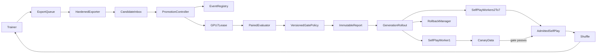

# Risk-Seeking KataGo Checkpoint Promotion Controller

## Purpose

This document is the implementation plan for closing the score-maximizing
KataGo training loop safely and quickly.

The controller must continuously identify useful checkpoints, evaluate them
against the current champion and immutable pretrained anchor, promote passing
models into self-play, and roll back bad generations without contaminating
training data.

The design optimizes two goals simultaneously:

1. **Learning speed:** a genuinely better policy should influence new self-play
   within hours, not after a large manual backlog accumulates.
2. **Safety and reproducibility:** no model may become active because of file
   ordering, incomplete evaluation, unpaired statistics, or a partial copy.

The neural-network architecture and powered search utility are not changed by
this project. The missing component is orchestration, statistics, lifecycle
management, and rollout control.

## Current state

As of the 2026-07-29 read-only live inspection:

- repository orchestration is based on
  `b6517702064aae869a6b762d6a90dd7d6f033948` plus the current reviewed
  production host-integration diff; the live checkout is clean at the
  original training revision
  `a51c32967fdfb246923aebf12801812504cfbd40`;
- the live run root is
  `/home/ubuntu/kata-go-artifacts/runs/training-a51c3296-p15-w4`;
- the active objective is `scorePower=1.5`, `scoreScale=20`,
  `winWeight=4`;
- one monolithic 700-thread self-play process uses the original b40 network
  on GPUs 0–6 with `switchNetsMidGame=true`;
- GPU 7 trains a b40 Muon/BF16 model, retains approximately 49 GB while
  data-bucket idle, and was not launched with
  `-stop-when-train-bucket-limited`;
- the newest staged name shows approximately 19 million fine-tuning samples
  consumed;
- 186 candidates are staged under `modelstobetested`;
- no live `promotion/` tree, frozen evaluation suite, or reviewed source
  position bank exists;
- the live `USEGATING=1` export loop still uses the legacy exporter, which
  removes each source checkpoint before publishing to `modelstobetested`;
- no trained candidate has been admitted to self-play; and
- the stock KataGo gatekeeper is intentionally disabled because it promotes
  solely from conventional win points.

This is a healthy but **open** learning loop. Search generates the desired
targets and training learns from them, but trained policy improvements do not
yet alter later self-play.

## Implementation status

Last updated: 2026-07-29.

Checked items have repository evidence. Live-run items remain unchecked until
they are verified on the actual training filesystem and H100 hosts.
The repository-foundation checklist records implemented building blocks; it
does not by itself establish an end-to-end automatic promotion path.
Repository Stage 0–2 execution alignment and position-bank curation tooling
are complete. That does not establish a reviewed live bank or deployment.
Mutation-enabled operation remains blocked until every required
live-environment item is checked.

### Existing prerequisites

- [x] Deterministic color-paired schedules expose stable `pairId` and
  `positionId` values.
- [x] Deterministic C++ match execution accepts separate per-bot model files
  and writes result and move-trace JSONL.
- [x] Powered score utility is available in search.
- [x] Training supports clean bucket-limited exit through
  `-stop-when-train-bucket-limited`.
- [x] Existing descriptive risk-score summaries and move comparisons are
  covered by Python tests.

### Repository foundation

- [x] Freeze promotion policy v1 and explicit powered/standard match configs.
- [x] Build independent, content-addressed evaluation suite banks and exact
  Stage 3 confirmation manifests.
- [x] Implement paired, position-clustered statistics and promotion gates.
- [x] Implement pair-safe evaluation sharding, validation, and recovery.
- [x] Implement hash-chained lifecycle state and champion compare-and-swap.
- [x] Implement exclusive GPU lease supervision.
- [x] Implement candidate intake, backlog coalescing, and reconciliation.
- [x] Harden checkpoint export and content-addressed publication.
- [x] Implement canary rollout, data admission, promotion, and rollback
  transactions.
- [x] Add the promotion operations runbook and all planned automated tests.

### Repository closure

- [x] Publish an immutable, statistically feasible promotion policy v2 while
  retaining v1 byte-for-byte for historical evidence.
- [x] Publish exact cumulative look-1/look-2 schedules with independent
  position-cluster quotas and separate Lead discovery/confirmation holdouts.
- [x] Build an in-repository evaluator evidence adapter from finalized match
  outputs through paired statistics to gate-grade promotion evidence.
- [x] Bind finalist ranking to finalized statistics artifacts and make the
  prespecified second confirmation look executable and crash-recoverable.
- [x] Bind Stage 0 request/probe evidence, schedule deep audits, and connect
  audit failures to rollback.
- [x] Complete reference-aware trash/grace handling, queue backpressure, and
  structured invariant/SLO status.
- [x] Add the remaining failure-injection tests and run the Python promotion
  suite in CI.
- [x] Pass final focused/full repository verification and record the exact
  commands below.

### Repository execution alignment

These items were discovered during the post-closure audit of actual Stage 0–2
execution. They must be complete before shadow evaluation consumes a real
position bank.

- [x] Make Stage 0 probe-only so it launches no ordinary or audit match matrix.
- [x] Bind Stage 1 to exactly 32 powered candidate-versus-champion discovery
  pairs at 400 visits.
- [x] Bind Stage 2 to 128 ordinary, 32 Lead-40, and 32 Lead-80 discovery pairs
  at 800 visits, with an original-model comparison only when it is distinct
  from the champion.
- [x] Include the effective visit count in every evaluation identity, runner
  command, and finalized runner artifact.
- [x] Publish exact Stage 1 and Stage 2 manifest cells and schedule prefixes.
- [x] Make the evaluator and evidence adapter validate the exact per-stage
  cell set instead of one fixed nonconfirmation matrix.

### Position-bank curation pipeline

The suite builder deliberately consumes reviewed labeled positions; no such
source bank currently exists in the repository or live run.

- [x] Implement deterministic PositionSample normalization, C++-readable
  output, semantic deduplication, and source provenance.
- [x] Implement hash-bound analysis-query generation and result ingestion
  against an immutable reference model.
- [x] Implement conservative ordinary, Lead-40, and Lead-80 auto-labeling with
  visit-stability checks.
- [x] Implement provenance-bound score prefiltering and immutable labeling
  bundle merging for targeted supplemental Lead corpora.
- [x] Implement explicit human-review queues for tactical, exploitability,
  bait, score-tail, sacrifice, small-gain/large-lead, and adversarial cases.
- [x] Publish a canonical curation manifest and fail closed when policy-v2 pool
  minima or review approvals are missing.
- [x] Cover deterministic curation and suite-builder handoff with automated
  tests.

### Production host integration

- [x] Implement request-bound Stage 0 and hardened-export CUDA model probes.
- [x] Implement bucket-limited trainer launch/drain with verified process
  identity and GPU-lease bootstrap.
- [x] Implement finite rollout workers, automatic completion
  acknowledgements, quiescent drain proofs, and persistent active-generation
  workers.
- [x] Implement dynamic all-role rollback identities, supervisor pause
  barriers, continuous-output quarantine, and trainer restoration.
- [x] Implement live filesystem/source/candidate preflight evidence and
  hash-pinned runtime/deployment manifest generation.
- [x] Require a live supervisor heartbeat and revalidate deployment hashes on
  every automatic controller iteration.
- [x] Cover host command, Stage 0, preflight, and runtime materialization
  contracts with automated tests.

Repository verification recorded so far:

- `uv run --with pytest pytest tests/test_evaluation_runner.py -q`
  (2026-07-28): 146 tests passed because `python/pytest.ini` appended the full
  `tests` selection; this was not a focused-file count.
- `uv run --with pytest pytest tests/test_promotion_state.py -q`
  (2026-07-28): 146 tests passed under the same appended full-suite selection.
- `uv run --with pytest pytest tests/test_gpu_lease.py
  tests/test_hardened_exporter.py -q` (2026-07-28): 147 tests passed under the
  appended full-suite selection; shell syntax and runtime JSON validation also
  passed.
- `uv run --with pytest pytest tests/test_paired_stats.py
  tests/test_promotion_gate.py tests/test_evaluation_runner.py
  tests/test_risk_score.py -q` (2026-07-28): 168 tests passed, including
  gate-report compatibility with the champion transaction loader.
- `uv run --with pytest pytest -q` (2026-07-28): 196 tests passed after
  controller/exporter integration, every promotion failure boundary, phased
  rollout, full-generation admission, and rollback recovery coverage.
- `PYTHONPATH=. uv run --with pytest pytest -c /dev/null
  tests/test_evaluation_runner.py -q` (2026-07-28): 35 focused hardening tests
  passed for semantic holdout identity, execution-bound keys, complete result
  rows, exact move traces, and five-cell confirmation planning.
- `PYTHONPATH=. uv run --with pytest pytest -c /dev/null
  tests/test_gpu_lease.py tests/test_hardened_exporter.py -q` (2026-07-28):
  36 focused tests passed for crash-safe checkpoint handoff, exclusive lease
  proof, path validation, and mandatory probed publication.
- `PYTHONPATH=. uv run --with pytest pytest -c /dev/null
  tests/test_paired_stats.py tests/test_promotion_gate.py -q` (2026-07-28):
  49 focused tests passed for exact cell/sample/artifact binding,
  cluster-level zero-event bounds, frozen suite provenance, explicit-risk
  consistency, and declared bootstrap strata.
- `uv run --with pytest pytest -q` (2026-07-28, final integrated run):
  254 tests passed.
- Final `compileall`, policy/runtime JSON parsing, exporter shell syntax, and
  `git diff --check` (2026-07-28): passed. `katago runtests` was not run because
  this workspace has no built KataGo binary; no C++ source was changed.
- `python3 -m compileall -q risk_score`, strict example-config loading,
  `bash -n python/selfplay/export_model_for_selfplay.sh`, and
  `git diff --check` (2026-07-28): passed.
- `PYTHONDONTWRITEBYTECODE=1 PYTHONPATH=. uv run --with pytest pytest
  -p no:cacheprovider -c /dev/null tests -q` (2026-07-29): 310 tests passed.
- Focused policy/statistics, suite/evidence, evaluator integration,
  state/recovery, and mid-pair/restart runs (2026-07-29): 68, 45, 73, 79, and
  63 tests passed, respectively.
- Policy v2 canonical SHA-256 (2026-07-29):
  `8562bcd7b835ae0cfcfe517a290748258da229b3fcf588dc99b3703c2b8f6023`.
- Final `compileall`, v1/v2 policy and runtime JSON parsing, promotion CLI
  help smokes, exporter shell syntax, GitHub workflow YAML parsing, pinned
  policy validation, and `git diff --check` (2026-07-29): passed.
- Stage 0–2 runner/evaluator/evidence/gate/recovery and position-curation
  focused run (2026-07-29): 163 tests passed.
- `PYTHONDONTWRITEBYTECODE=1 PYTHONPATH=. uv run --with pytest pytest
  -p no:cacheprovider -c /dev/null tests -q` (2026-07-29, execution-alignment
  and curation run): 318 tests passed.
- Final `compileall`, v1/v2 policy and runtime JSON parsing, promotion and
  curation CLI help smokes, exporter shell syntax, and `git diff --check`
  (2026-07-29): passed.
- Production host integration run (2026-08-01): 326 tests passed and 2
  Linux-procfs process-lifecycle tests were skipped on macOS; those tests
  remain required on the H100 host before deployment.

### Final audit hardening

- [x] Bind every gate metric to its required matrix cell, exact sample count,
  runner/statistics artifact, and immutable provenance.
- [x] Use position-cluster-aware exact zero-event bounds and recompute them in
  the gate.
- [x] Reject incomplete terminal result rows and truncated or misattributed
  move traces before evaluation finalization.
- [x] Include binary, environment, topology, tracing, and argv inputs in the
  evaluation identity.
- [x] Carry frozen Lead-40/80 suite identity through schedules, results,
  statistics, and the five-cell confirmation matrix.
- [x] Reject semantic position reuse across discovery and confirmation despite
  differing labels or metadata.
- [x] Enforce trace-derived catastrophe flags and the declared bootstrap
  strata.
- [x] Enforce GPU lease proof around automatic evaluation and recover
  drain-time checkpoint crashes safely.
- [x] Rank finalists by frozen utility/risk policy and keep every discovery
  stage off confirmation holdouts.
- [x] Require hashed canary/intermediate health reports and quiescent,
  stable worker outputs before data admission.
- [x] Make worker launch, automatic promotion, rollback, and projection repair
  fully replay-safe under the owning process-lifetime lock.
- [x] Bind seven-worker topology and immutable self-play config to policy
  provenance, and publish read-only generation model copies.
- [x] Enforce path containment/alias safety and require the gated exporter
  model-load/finite-output probe.
- [x] Preserve frozen v1 as historical evidence and publish v2 with feasible
  final-look sample sizes. V2 requires 1,024 independent ordinary/Lead-40
  clusters and 2,048 Lead-80 clusters at look 2, giving exact zero-event upper
  bounds of approximately 0.470% and 0.235%, respectively.

### Live environment validation

- [ ] Deploy a reviewed post-alignment source snapshot without modifying the
  checkout used by the running export loop.
- [ ] Install a production runtime configuration and Stage 0 probe command
  with mutation disabled.
- [ ] Switch the live exporter to the hardened, probed, backpressure-aware
  path without losing an in-flight checkpoint.
- [ ] Inventory and hash the staged candidate backlog.
- [ ] Generate a quarantined original-model SGF corpus that is never admitted
  to the shuffler or trainer, and bind its exclusion roots in the harvest plan.
- [ ] Freeze real discovery, confirmation, audit, tactical, and exploitability
  position banks.
- [ ] Validate atomic rename and fsync semantics on the training filesystem.
- [ ] Run CUDA model-load and fixed-position probes on representative b40
  checkpoints.
- [ ] Benchmark 4, 8, and 16 evaluator processes on GPU 7.
- [ ] Migrate self-play to seven generation-pinned workers.
- [ ] Complete canary and rollback drills before and after data admission.
- [ ] Complete the first PASS promotion and observe its data being shuffled and
  consumed by training.

## Correctness gaps that must be addressed

The existing deterministic match and risk-score scripts are data-collection
building blocks, not a complete promotion system.

Before promotion automation, implementation must correct these assumptions:

- checkpoint matches must compare different candidate/reference network files
  with identical search utility settings on both bots;
- every command must explicitly use `winWeight=4`; checked-in defaults of 2
  must never leak into this run;
- statistics must operate on color pairs and `positionId` clusters, not treat
  games as independent;
- promotion metrics must include games with missing numeric scores using their
  defined outcome/no-result treatment rather than silently biasing means;
- discovery and confirmation must use independent schedules;
- candidate selection from a backlog must not reuse the final holdout;
- GPU 7 must be exclusively leased between trainer and evaluator;
- activation must not depend on an accidental model-file modification time;
- mid-game model switching must be disabled for clean generation lineage; and
- promotion, rollback, and report finalization must be idempotent after a
  process or machine crash.

## Non-negotiable invariants

The controller must enforce these invariants before performance optimization:

- exactly one controller may mutate candidate lifecycle state;
- trainer and evaluator never compute concurrently on GPU 7;
- a candidate identity is its SHA-256, not its path or mtime;
- all evaluation inputs are immutable and content-addressed;
- every counted result belongs to a complete color pair;
- a promotion uses the champion SHA that the evaluation actually tested;
- no candidate is activated without a finalized gate report;
- the previous champion and its trainer checkpoint remain rollback-pinned;
- canary data is quarantined until rollout commits;
- self-play data is attributable to exactly one network generation;
- an incomplete export, match shard, or report never becomes visible as final;
- rollback never relies on touching an old model to manipulate mtime; and
- all destructive cleanup is reference-aware and delayed by a grace period.

## Target architecture



The controller is Python orchestration. Existing C++ search, match, model
loading, and training-data generation remain the execution engines.

## Files to add

### Controller and state

- `python/risk_score/promotion_controller.py`
  - single-writer lifecycle loop;
  - reconciliation after restart;
  - candidate coalescing;
  - evaluation scheduling;
  - gate execution;
  - promotion and rollback transactions.
- `python/risk_score/promotion_state.py`
  - typed candidate/generation state machines;
  - immutable event records;
  - registry reconstruction;
  - compare-and-swap champion updates.
- `python/risk_score/gpu_lease.py`
  - exclusive GPU 7 trainer/evaluator ownership;
  - process identity verification;
  - clean drain and restart;
  - watchdog recovery.

### Evaluation and statistics

- `python/risk_score/paired_stats.py`
  - color-pair and position-cluster estimators;
  - confidence intervals;
  - sequential boundaries;
  - catastrophe risk differences;
  - stratified bootstrap sensitivity checks.
- `python/risk_score/promotion_gate.py`
  - versioned PASS/FAIL/INCONCLUSIVE policy;
  - hard safety checks;
  - optimization checks;
  - machine-readable reasons.
- `python/risk_score/evaluation_runner.py`
  - schedule sharding at complete `pairId` boundaries;
  - bounded parallel match subprocesses;
  - output validation and retry;
  - candidate/champion/original matrices.
- `python/risk_score/promotion_evaluator.py`
  - manifest-bound matrix execution;
  - exact champion-model hash resolution;
  - Stage 0 artifact reuse;
  - atomic runner-manifest and evidence publication.
- `python/risk_score/promotion_evidence.py`
  - finalized runner-to-statistics assembly;
  - exact five-cell and combined-Lead evidence binding;
  - Stage 0 and discovery provenance;
  - canonical controller evidence publication.
- `python/risk_score/build_evaluation_suites.py`
  - frozen ordinary, Lead-40, Lead-80, tactical, and exploitability suites;
  - independent discovery, confirmation, and audit holdouts.
- `python/risk_score/position_samples.py`
  - shared PositionSample validation and gameplay-semantic identity;
  - deterministic analysis query construction.
- `python/risk_score/curate_position_bank.py`
  - content-bound SGF harvest plans and analysis execution;
  - conservative automatic labels and explicit specialized review queues;
  - policy-minimum validation and canonical reviewed-bank publication.
- `python/risk_score/model_probe.py`
  - deterministic CUDA model-load and finite-output publication probe.
- `python/risk_score/stage0_probe.py`
  - request-bound fixed-position, tactical, exploitability, perspective,
    clamp, decomposition, and visit-stability checks.
- `python/risk_score/promotion_host.py`
  - trainer, rollout-worker, active-worker, rollback, and feedback
    supervision with PID-reuse protection.
- `python/risk_score/promotion_preflight.py`
  - run-volume semantics, deployment snapshot, and candidate inventory.
- `python/risk_score/build_live_runtime.py`
  - strict host runtime materialization and continuous deployment hash
    verification.

### Configuration

- `cpp/configs/risk_score/promotion_powered_match.cfg`
  - candidate and reference both use powered search;
  - both use power 1.5, scale 20, weight 4;
  - only model paths and bot names differ.
- `cpp/configs/risk_score/promotion_standard_match.cfg`
  - candidate and original both use standard KataGo utility;
  - ordinary-strength safety control.
- `cpp/configs/risk_score/promotion_curation_analysis.cfg`
  - deterministic standard/powered query baseline for position curation;
  - one leased GPU with binary, config, model, query, and result hash binding.
- `cpp/configs/risk_score/promotion_curation_lead_selfplay_19x19.cfg`
  - quarantined original-model corpus generation for supplemental Lead-40 and
    Lead-80 discovery;
  - fixed rules with uncompensated asymmetric playout strength, while
    manifest-bound analysis remains authoritative for labels.
- `python/risk_score/promotion_policy_v1.json`
  - immutable historical policy and evidence identity.
- `python/risk_score/promotion_policy_v2.json`
  - feasible cumulative sample/cluster counts, confidence levels, safety
    margins, queue limits, sequential boundaries, and rollout thresholds.
- `docs/RiskSeekingCheckpointPromotionRunbook.md`
  - installation, supervision, recovery, manual override, and incident
    procedures.

### Tests

- `python/tests/test_paired_stats.py`
- `python/tests/test_promotion_gate.py`
- `python/tests/test_promotion_state.py`
- `python/tests/test_gpu_lease.py`
- `python/tests/test_evaluation_runner.py`
- `python/tests/test_promotion_evaluator.py`
- `python/tests/test_promotion_evidence.py`
- `python/tests/test_hardened_exporter.py`
- `python/tests/test_promotion_recovery.py`
- `python/tests/test_curate_position_bank.py`
- `python/tests/test_stage0_probe.py`
- `python/tests/test_promotion_host.py`
- `python/tests/test_promotion_preflight.py`
- `python/tests/test_build_live_runtime.py`

No C++ change is required for the first production controller. Optional C++
improvements are listed later.

## Authoritative state and filesystem layout

The controller keeps authoritative state as immutable JSON event files and
final report bundles under the training run:

```text
promotion/
  controller.lock
  champion.json
  events/
  candidates/
    discovered/
    claimed/
    superseded/
    rejected/
    quarantined/
  evaluations/
    partial/
    final/
  reports/
  rollouts/
  rollback/
  trash/
```

Each event contains:

- monotonically increasing sequence number;
- previous event hash;
- UTC timestamp;
- controller build/source hash;
- candidate, champion, and original hashes;
- transition name;
- evaluation key, if applicable;
- exact config/schedule/policy hashes; and
- reason and actor.

A local SQLite database may index these files for fast queries, but it is
rebuildable and never authoritative. SQLite WAL must not be relied upon until
filesystem semantics are verified.

The controller holds one advisory lock in a local lock directory. A second
controller must exit before scanning or moving any candidate.

## Candidate identity and intake

The candidate ingestor watches complete directories in `modelstobetested`.

For every candidate:

1. Atomically rename it into a controller-owned `claimed` directory on the
   same filesystem.
2. Verify expected files exist and no `.tmp` or `.exported` content remains.
3. Compute SHA-256 for inference model, cleaned checkpoint, config metadata,
   and complete directory manifest.
4. Load the network with the current CUDA binary and run finite-output,
   perspective, score-bound, and utility-decomposition probes.
5. Parse training sample and data counters from the candidate name and
   checkpoint.
6. Deduplicate exact model hashes.
7. Register parent champion and training-data generation.

Any hash/path contradiction quarantines the candidate and stops promotion
mutation until reconciled.

## Backlog policy

Evaluating all 100 current candidates with the full gate would delay the first
closed-loop improvement and overfit the evaluation set.

For the current pre-promotion lineage:

1. Hash and inventory all candidates.
2. Keep the original, earliest candidate, newest candidate, and checkpoints at
   approximately 500k-sample intervals.
3. Include checkpoints adjacent to training anomalies or validation spikes.
4. Mark unselected candidates `SUPERSEDED`, not statistically rejected.
5. Screen the newest anchor first.
6. Use successive halving to retain at most four finalists.
7. Confirm exactly one finalist on the untouched confirmation schedule.
8. Promote at most one model from this entire pre-promotion lineage.

After a champion changes, candidates trained solely from the prior champion
become stale. They may remain archival anchors but may not be promoted against
the new generation without a fresh confirmation.

Going forward:

- produce one screen candidate per 500k newly trained samples;
- allow at most one confirmation candidate per 1M samples;
- keep no more than three active evaluator entries;
- coalesce newer queued checkpoints before screening begins;
- never replace a candidate once one of its stages has started; and
- apply export backpressure so staged storage does not grow without bound.

## Evaluation suites

The implementation freezes three independent ordinary-position banks:

- **discovery:** candidate ranking and successive halving;
- **confirmation:** the only bank that may authorize promotion;
- **audit:** periodic deep checks and rollback investigations.

It also freezes:

- Lead-40 positions;
- Lead-80 positions;
- ordinary tactical refutations;
- low-probability high-score baits;
- exaggerated score-tail positions;
- whole-board sacrifice traps;
- small-gain/large-lead risks; and
- adversarial continuations where the opponent declines cooperation.

Every position appears from both player perspectives. Repetitions from one
position remain one statistical cluster.

Suite files, generation scripts, exclusions, and labels are hashed and included
in every report.

## Statistical unit and utility estimator

For candidate \(C\), each game is converted to candidate perspective:

- outcome \(y=1,0,-1\) for win, draw, loss;
- score margin \(m\) positive when candidate is ahead; and
- realized utility:

\[
U_C =
4y +
\operatorname{sign}(m)
\left[
\left(1+\frac{|m|}{20}\right)^{1.5}-1
\right].
\]

For one color pair \(j\):

\[
Z^U_j = \frac{U_{j,1}+U_{j,2}}{2}.
\]

Positive mean \(Z^U\) means candidate superiority. It must not be multiplied by
two again.

Win score and catastrophe differentials use the same pair:

- win/draw/loss is scored \(1,0.5,0\);
- candidate Final-20/50 events are compared with the reference model's
  corresponding event;
- Lead-40/80 and high-confidence losses come from own-turn traces; and
- repeated pairs sharing a `positionId` are averaged before inference.

Network-predicted utility remains a calibration diagnostic. Realized terminal
utility is the optimization metric.

## Multi-stage evaluation

The gate has a fast lane for frequent safe promotions and a separate deep
audit lane. This prevents both reckless promotion and statistically excessive
latency.

### Stage 0: integrity and fixed probes

Run for every selected anchor:

- model/checkpoint hash and architecture compatibility;
- CUDA load and finite-output smoke;
- 256 fixed analysis positions at 200 visits;
- exploitability sentinels at 2,000 visits;
- perspective and legal-bound checks;
- utility decomposition and endpoint-tail checks; and
- policy distance from champion.

Near-identical candidates may be superseded without games.

### Stage 1: cheap paired screen

Defaults:

- 32 distinct ordinary color pairs;
- 400 visits;
- candidate versus current champion;
- candidate and champion both use powered utility weight 4;
- complete-pair schedule shards; and
- up to eight evaluator subprocesses on leased GPU 7.

Reject immediately for:

- model/runtime error;
- malformed or incomplete pairs;
- hard tactical/exploit failure;
- nonfinite or score-bound violation;
- gross ordinary-strength loss;
- utility upper bound at or below zero under a prespecified futility rule; or
- catastrophe harm already beyond the maximum allowed margin.

Stage 1 is discovery only and can never authorize promotion.

### Stage 2: finalist selection

For at most four survivors:

- 128 ordinary pairs at 800 visits;
- 32 Lead-40 pairs;
- 32 Lead-80 pairs;
- candidate versus champion;
- candidate versus original when champion differs; and
- independent discovery schedule.

Rank safe candidates by the lower confidence bound on realized powered utility.
Ties within 0.10 utility prefer lower Final-50 risk, then the later checkpoint.

Exactly one candidate advances.

### Stage 3: promotion confirmation

Fast confirmation defaults:

- 256 ordinary pairs at 2,000 visits;
- 64 Lead-40 pairs;
- 64 Lead-80 pairs;
- candidate versus champion;
- candidate versus immutable original;
- 128 standard-utility pairs at 800 visits against original; and
- full per-move diagnostics.

Use a first look at half the sample. Promote early only when every condition
passes. Stop early for proven harm or prespecified low conditional power.

If inconclusive, extend the ordinary sample to 512 pairs and lead suites to 128
pairs each.

### Deep audit lane

Every fifth promotion, and any candidate near a safety boundary, receives:

- at least 1,024 ordinary pairs;
- expanded lead suites;
- the full 128-position exploitability bank;
- candidate/champion/original/b28 controls;
- 2,000 and 8,000 visit stability checks; and
- higher-precision reruns for suspicious endpoint-tail choices.

Deep audits run asynchronously and can trigger rollback. They do not block every
routine safe promotion.

## Confidence and sequential testing

Historical v1 thresholds remain frozen in `promotion_policy_v1.json`; all new
automatic evaluations use the independently frozen
`promotion_policy_v2.json`.

Primary inference:

- position-clustered estimates;
- color-paired means;
- one-sided confidence bounds;
- cluster-robust standard errors with small-sample correction; and
- stratified wild-cluster bootstrap sensitivity analysis.

Catastrophe metrics use one-sided matched-risk-difference bounds. Zero observed
events do not imply zero risk.

Discovery results may select one finalist but may not support its final
promotion claim. Confirmation uses a fresh schedule. If a finalist fails,
testing a fallback requires a new holdout block and a new alpha allocation.

The first implementation uses:

- one-sided 95% bounds for routine optimization/noninferiority decisions;
- one-sided 99% bounds for catastrophic-risk constraints;
- two prespecified looks;
- intersection-union logic because every hard gate must pass; and
- an attempt budget recorded per generation to control repeated candidate
  testing.

After operational benchmarking, sample sizes may change only by publishing a
new versioned policy before seeing affected results.

## Promotion criteria

Every condition is mandatory.

### Optimization

- powered-search realized utility lower bound is above zero versus champion;
- powered-search realized utility lower bound is above zero versus original;
- combined Lead-40/80 utility is noninferior, with lower bound above -0.05; and
- candidate is not dominated by a later safe finalist selected in discovery.

### Ordinary strength

- powered-search win-rate lower bound exceeds 47% versus champion;
- powered-search win-rate lower bound exceeds 47% versus original; and
- standard-search win-rate lower bound exceeds 45% versus original.

These are safety floors, not the primary objective.

### Catastrophic-risk noninferiority

Candidate-minus-reference upper bounds must satisfy:

- Final-20: no more than +2.0 percentage points;
- Final-50: no more than +1.0 point;
- Lead-40 loss: no more than +0.5 point;
- Lead-80 loss: no more than +0.25 point;
- high-confidence loss: no more than +0.5 point;
- targeted Lead-40 suite loss risk: no more than +3 points; and
- targeted Lead-80 suite loss risk: no more than +2 points.

### Validity and exploitability

- no missing games, duplicate IDs, incomplete pairs, resignations, or turn
  limits;
- true no-results are separately reported and remain below 0.1%;
- no unresolved hard tactical or exploitability failure;
- no perspective, clamp, endpoint, nonfinite, or decomposition violation;
- no selected move dominated by unrealistic endpoint mass;
- acceptable move stability as visits rise; and
- complete provenance and hashes.

Failure or maximum-sample inconclusive means no promotion. Thresholds are not
relaxed after viewing results.

## GPU 7 leasing

Low utilization is not sufficient to claim GPU 7. The persistent trainer keeps
its CUDA context and approximately 49 GB allocated while waiting for data.

The robust operating model is trainer bursts:

1. Start trainer with `-stop-when-train-bucket-limited`.
2. Let it checkpoint and exit when data credit is consumed.
3. Verify the process group has terminated.
4. Confirm no foreign GPU 7 process remains for repeated observations.
5. Grant an evaluator lease.
6. Run bounded evaluation shards.
7. Drain evaluator processes and verify GPU state.
8. Restart trainer from its persistent checkpoint.

The controller records:

- lease ID;
- process PID, start time, boot ID, command hash, and cgroup;
- expected GPU UUID;
- checkpoint hash at handoff;
- drain observations; and
- start/finish events.

`SIGSTOP` alone is prohibited because it retains the CUDA context and does not
constitute a clean GPU handoff.

The controller has a `finally`/watchdog path that always restores a trainer
after evaluator failure unless the run is explicitly halted for safety.

## Evaluation throughput

Deterministic match mode currently permits one game and one search thread per
process. Parallelism is implemented by splitting schedules only at complete
`pairId` boundaries.

Initial GPU 7 benchmark:

- 4 evaluator processes;
- then 8;
- then 16 if memory and throughput remain healthy.

Freeze the fastest topology that preserves deterministic per-shard results.
Every candidate/reference comparison uses the same topology.

Optional later C++ work can add deterministic multi-game batching to one match
process. This is an optimization, not a prerequisite.

## Promotion transaction

Promotion is compare-and-swap against the champion hash tested in confirmation.

1. Verify finalized PASS report, policy hash, and expected champion SHA.
2. Ensure candidate remains in controller-owned claimed storage.
3. Create `selfplay/<candidate>/{sgfs,tdata,vadata}`.
4. Pin previous champion, trainer checkpoint, and data/shuffle watermarks.
5. Write and fsync promotion intent.
6. Atomically rename candidate directory into accepted storage.
7. Verify destination hashes.
8. Start isolated canary self-play workers.
9. Record worker acknowledgements of exact candidate SHA.
10. Admit canary data only after canary PASS.
11. Roll out remaining workers.
12. Atomically commit `champion.json`.
13. Record first game, first tdata, first shuffle, and first training
    consumption for the new generation.

If source is absent after a crash but the exact hash is at the destination, the
controller completes the transaction. Any different destination hash causes
quarantine and a controller halt.

## Self-play topology and canary rollout

The current one-process, seven-GPU topology cannot provide a true partial
canary. It also uses mtime selection and permits mid-game switching.

Before the first automated promotion:

- restart self-play as seven one-GPU workers;
- set `switchNetsMidGame=false`;
- give each worker an immutable accepted-model leaf directory;
- use 100 game threads per worker as the initial equivalent of the current 700;
- write each worker/generation to a distinct output root; and
- admit only controller-approved generation directories to the shuffler.

Rollout sequence:

1. **1/7 canary:** 2,000 games, quarantined from training.
2. **3/7 rollout:** require throughput, schema, purity, and behavioral checks.
3. **7/7 rollout:** all workers acknowledge the same SHA.
4. **Generation commit:** canary data becomes admissible and shuffling resumes.

This removes mtime ambiguity, enables real rollback, and prevents a mixed-model
game from being attributed only to its final network.

## Canary and rollback

The canary runs production search settings but writes outside admitted
self-play.

It must pass:

- model identity and output-schema checks;
- crash/error-rate checks;
- throughput floor;
- game purity (one network SHA);
- 1,024-pair fresh audit against previous champion;
- no hard exploit/tactical regression; and
- catastrophe boundaries from the promotion policy.

Rollback levels:

### Before canary admission

- stop candidate workers;
- restore previous champion workers;
- quarantine canary output;
- mark candidate `CANARY_FAILED`;
- no trainer rollback is needed.

### After admission, before trainer consumption

- stop affected shuffler/trainer intake;
- quarantine candidate generation and derived shuffles;
- restore previous champion workers;
- resume from existing trainer checkpoint.

### After trainer consumption

- stop self-play, shuffle, trainer, and exporter;
- quarantine all candidate-derived data and shuffle directories;
- restore pinned pre-promotion trainer checkpoint;
- restore prior champion worker generation;
- run bounded recovery smoke; and
- resume only after a written rollback event.

One ordinary catastrophe triggers forensic review, not automatic rollback,
unless it reproduces a predefined exploit failure.

## Export hardening

The current shell exporter removes its source checkpoint before compression and
final rename. The hardened implementation must:

1. Keep source candidate intact.
2. Export into a unique `.partial` directory.
3. Validate model load and finite outputs.
4. Compress and hash all outputs.
5. Write a complete manifest.
6. Fsync files and directory.
7. Atomically rename into `modelstobetested`.
8. Only then mark or remove the source through retention policy.

Duplicate candidate names with different hashes are fatal.

## Storage management

The controller retains:

- immutable original model;
- current and previous champions;
- rollback trainer checkpoint;
- finalized promotion reports;
- frozen policies/configs/schedules;
- current evaluation candidate;
- last five evaluated anchors; and
- representative milestones.

The current backlog is inventoried before deletion. Superseded candidates move
atomically to `trash`, receive a deletion manifest, and remain through a grace
period.

Deletion proceeds only when the registry has no reference from:

- champion lineage;
- rollback pin;
- active/partial evaluation;
- finalized report;
- audit holdout;
- trainer recovery; or
- incident investigation.

Initial limits:

- warning when important evaluation queue exceeds four;
- warning when projected 72-hour growth reaches free-space reserve;
- producer halt before free space drops below the larger of 10% or a
  24-hour growth reserve; and
- export cadence automatically reduced when evaluation lags.

## Monitoring and service-level objectives

Structured status includes:

- champion and generation SHA;
- candidate queue age/depth;
- active evaluation stage and progress;
- GPU lease owner and process identity;
- trainer bucket state;
- self-play worker model acknowledgements;
- canary/admitted game counts;
- evaluation throughput and ETA;
- report completeness;
- staged and retained bytes;
- promotion-to-first-data latency; and
- promotion-to-training-consumption latency.

Initial targets:

- controller reconciliation after restart: under 2 minutes;
- candidate detection: under 2 minutes;
- GPU lease handoff: under 90 seconds;
- important candidate screen: under 1 hour;
- routine full confirmation: under 4 hours when GPU 7 is available;
- worker activation acknowledgement: under 60 seconds plus model load;
- important queue depth: no more than four;
- incomplete pairs counted: zero;
- promotions without complete report: zero; and
- wrong-SHA model loads: zero.

## Failure-injection testing

Automated tests must cover:

- controller restart in every candidate state;
- competing controller instances;
- candidate rename races with exporter;
- duplicate name/different hash;
- kill after every promotion filesystem step;
- evaluator death between the two games of a color pair;
- malformed/truncated JSONL;
- stale champion during confirmation;
- trainer/evaluator GPU lease conflict;
- foreign GPU 7 process;
- trainer failure to checkpoint or drain;
- model load failure;
- canary worker partial acknowledgement;
- rollback before and after data admission;
- rollback after trainer consumption;
- insufficient disk;
- registry/index loss and rebuild; and
- filesystem rename/fsync behavior on the actual run volume.

Repository coverage status:

- [x] Competing controller lock, candidate/export rename conflicts, duplicate
  name/different hash, malformed JSONL, stale champion, GPU lease conflicts,
  trainer drain failures, model-probe failures, partial worker
  acknowledgements, rollback boundaries, insufficient disk, and registry
  replay.
- [x] Kill-after-step recovery across the promotion filesystem transaction.
- [x] Explicit evaluator death after only one game of a color pair.
- [x] Parametric restart coverage from every candidate evaluation state,
  including between confirmation looks.
- [x] End-to-end runner-to-statistics-to-real-gate-to-controller coverage
  without injected PASS fields.
- [x] Deep-audit scheduling and asynchronous rollback-trigger coverage.
- [ ] Actual run-volume rename/fsync and b40 CUDA failure drills; these remain
  live-environment items.

Repository tests include unit fixtures, statistical golden data, bounded
dummy-model integration, and deterministic parametrized idempotency coverage
without an external property-testing dependency. Actual b40 CUDA smokes remain
pending.

## Implementation phases

### Phase 0: freeze policy and inventory

Duration: approximately half a day.

- inventory and hash all staged candidates;
- retain promotion policy v1 and freeze the corrected policy v2;
- freeze discovery/confirmation/audit schedules;
- verify current source, binary, configs, GPU identity, and filesystems;
- measure candidate storage and export cadence;
- confirm stock gatekeeper is absent; and
- pin original/champion/rollback artifacts.

### Phase 1: paired statistics and shadow gate

Duration: 1–2 days.

- implement pair/position-aware metrics and confidence bounds;
- implement versioned gate policy;
- build statistical golden fixtures;
- replay existing Phase 1 results;
- run controller in recommendation-only mode;
- compare decisions with independent review; and
- produce no filesystem promotions.

### Phase 2: controller, registry, and GPU lease

Duration: 1–2 days.

- implement candidate intake/coalescing;
- implement event registry and reconciliation;
- convert trainer to supervised bucket-limited bursts;
- implement GPU 7 drain/lease/restart;
- implement deterministic evaluation sharding;
- add crash-resume and partial quarantine; and
- screen current backlog anchors.

### Phase 3: promotion transaction and rollout

Duration: 1–2 days.

- harden exporter transaction;
- implement compare-and-swap promotion;
- split self-play into seven generation-pinned workers;
- disable mid-game switching;
- implement canary data quarantine/admission;
- implement rollback watermarks and trainer restore; and
- execute full fault drills.

### Phase 4: production automation and throughput tuning

Duration: approximately one day.

- run shadow and manual promotion cycles;
- benchmark evaluator process count;
- tune candidate/export cadence;
- enable automatic PASS promotion after policy equivalence is demonstrated;
- install monitoring/alerts; and
- execute first closed-loop promotion.

Expected total engineering time is approximately 4–7 days. A shadow screen of
the current backlog should be available within 1–2 days; the first robust
closed-loop promotion should be possible within 3–5 days.

## Live-run migration

The current training processes can continue during Phases 0–2.

Immediate migration sequence:

1. Stop increasing the useful backlog by coalescing new exports at 500k-sample
   milestones.
2. Inventory all existing candidates without moving them.
3. Screen newest and sample-spaced anchors first.
4. Keep training/self-play running while CPU-only integrity and fixed-position
   work proceeds.
5. At a trainer bucket boundary, checkpoint and yield GPU 7 for game
   evaluation.
6. Do not promote into the current monolithic self-play process.
7. Before first promotion, restart self-play as generation-pinned workers with
   mid-game switching disabled.
8. Run one manual canary and rollback drill.
9. Promote the first passing candidate.
10. Admit its data and verify the first closed-loop trainer consumption event.

## Definition of done

Implementation is complete only when:

- all new Python tests and existing C++/Python suites pass;
- policy/config/schedule/report hashes are complete;
- controller restart is idempotent in every state;
- GPU trainer/evaluator overlap is impossible by construction;
- current backlog is inventoried and bounded;
- candidate screening and confirmation run from immutable inputs;
- gate decisions use paired, position-clustered statistics;
- first promotion transaction survives injected failures;
- seven self-play workers acknowledge the intended generation SHA;
- mid-game switching is disabled;
- canary data remains quarantined until commit;
- rollback is demonstrated before and after data admission;
- one candidate is promoted and produces self-play data;
- that data is shuffled and consumed by the trainer;
- previous champion and checkpoint remain recoverable; and
- monitoring exposes promotion-to-feedback latency and every safety invariant.

At that point, the network is in a robust closed learning loop: improved
policies are promoted quickly, unsafe candidates are rejected, and every
generation can be reproduced or rolled back.
